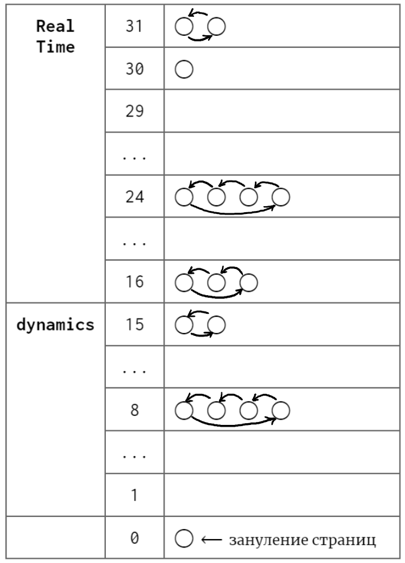
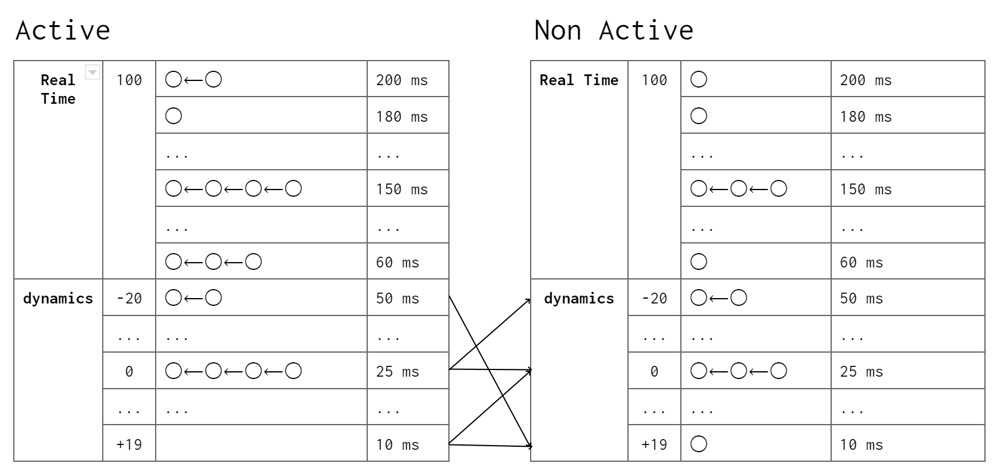

# Операционные системы (3 семестр, Маятин)

## Лекция 1

**Операционная система** - базовое системное программное обеспечение, управляюще работой вычислительного узла и реализующее универсальный интерфейс между аппаратным обеспечением, программным обеспечением и пользователем.

### Первый этап эволюции ОС: программы-диспетчеры

**Принципы архитектуры Фон Неймана**
1. Однородность памяти (код и данные в единой памяти)
2. Принцип адресности (оперативная память представляет собой линейно адресуемое пространство и процессор может обратиться к произвольной ячейке памяти в любой момент)
3. Программное управление
4. Всё кодируется с помощью двоичного кода

*Архитектуру Фон Неймана реализуют начиная с 40-х годов XX в.*

Процессор выполнял программы последовательно, инкрементируя адрес инструкции. Некоторые функции было необходимо использовать многократно. Чтобы не повторять один и тот же участок кода появилась идея использовать часть памяти для хранения часто повторяющихся инструкций (подпрограмм). Чтобы знать куда вернуться после выполнения подпрограммы создали **программы-диспетчеры**.

Процессор выполнял и работу с памятью, и вычисления. Очевидно, что для работы с памятью не требуется вся мощность процессора, поэтому создали **контроллеры**, которые умели только вычислять адреса и подгружать/выгружать данные.

**Прерывание** - сигнал, поступающий от внешнего устройства к ЦП, приостанавливающий выполнение текущего набора команд и передающий управление подпрограмме - обработчику прерываний. Работа с помощью контроллера - SPOOLing.

**Пакет** - совокупность программных модулей и данных (например, констант).

**Пакетная обработка (batch processing)** - выполнение "заданий, которые могут выполняться без взаимодействия с конечным пользователем или могут быть запланированы для выполнения, если позволяют ресурсы" (определение из интернета).

*Реализация пакетной обработки требует создания алгоритмов планирования, о которых будет вестись речь в дальнейшем.*

### Второй этап эволюции ОС: мультипрограммные ОС

*Идея*: несколько программ можно параллельно (фактически стали выполнять *псевдопараллельно*, так как количество потоков существенно превышало количество ядер, каждому процессу выделяется некоторое время для работы - кванты непрерывного выполнения, их длительность не превышает 1 мс).

**Варианты реализации псевдопараллельного выполнения:**
1. Использовать в коде специальные метки для переключения между потоками (раньше отказались, сейчас реализовано, например, в коорутинах Kotlin).
2. Таймер генерирует прерывания (уже были кварцевые часы), а обработчик прерываний решает, какой процесс дальше должен выполняться. Данный метод требует решения следующих задач:
   1. *Работа с регистрами*. Если программа загрузила данные в регистры, было сгенерированно прерывание, другой процесс испортил данные в регистрах, то после этого программа не сможет работать корректно. Решение - сохранение регистровых контекстов.
   2. *Работа с памятью*. Код нового процесса может быть где угодно, поэтому непонятно, как выполнять адресацию. Решение - концепция виртуальной памяти, использовать виртуальные адреса и подменять их физическими (*когда пересчитывать адреса?*).
   3. *Обеспечение защиты программных данных от других программ*. Программа может ошибиться с адрессаций и испортить данные "коллеги". Введена концепция защиты памяти, реализованная аппаратно, а также привелегированный режим - режим процессора, при котором отключается защита памяти.
        * **System call** - абстракция аналогичная механизму прерываний между ОС и ПО, обращение пользовательской программы к ядру ОС с требованием предоставить ресурсы и выполнить привелегированную операцию.
   4. *Планирование выполнения программы и использования ресурсов*. Теперь очередей много и они могут быть связаны между собой, а алгоритмы планирования должны быть высокопроизводительными. Представим, что есть два неразделяемых ресурса (r<sub>1</sub> и r<sub>2</sub>) и две программы (p<sub>1</sub> и p<sub>2</sub>). p<sub>1</sub> захватилa ресурс r<sub>1</sub>, p<sub>2</sub> захватила ресурс r<sub>2</sub>, в процессе выполнения программе p<sub>1</sub> потребовался ресурс r<sub>2</sub>, p<sub>2</sub> - r<sub>1</sub>. Такая ситуацию назвали **тупиком**. Данную проблему решал Дейкстра на протяжении 15-ти лет и в дальнейшем ей занимались его ученики. 
   5. *Универсальный доступ к информации на внешних устройствах*. Раннее внешнаяя память была устроена линейно, как RAM. Однако такой подход неэффективен, так как не понятно, какие разделы (конечного размера) выделять программам, что делать, если несколько программ хотят работать с одной областью памяти. Введено понятие *файла*.
        * **Файл** - именованная совокупность данных. Для удобства введена **файлово-каталожная модель доступа к файлам**, которая сейчас реализована разными способами (например, Windows использует древовидную модель, в Linux реализуют виртуальную структуру).
   6. *Обеспечение комуникации между программами*. Механизмы:
        * **Буфер** - область памяти, в которую можно класть информацию, которую необходимо передать в другой процесс.
        * **Конвееры** (1 лабораторная) - перенаправление потоков ввода и выводы в другие процессы.
        * **Именованные каналы** (3 лабораторная) - обмен сигналов между программами.
        * **Виртуальная машина** - механизм, который реализует изоляцию процессов и завершает концепцию операционной системы (50 - 60-е годы).

**Первая операционная система** (*1963 г, суперкомпьютер B5000 компании burroughs*) - MCP (main control program).

*На данном этапе развития были специальные заведения, в которых можно было ареновать машинное время, передать оператору перфокарту и выполнить программу (узнать, что ошибся в одном байте -_-).*


### Третий этап эволюции ОС: сетевые операционные системы.
*Теперь компьютеры стали более популярны, поэтому затраты на гостиницы и доставку перфокарт до ближайшего города с компьютером стали слишком не выгодны. Хочется многотерминальности. Идея - передавать сигнал удаленно (если что, по телефону диктовать код программы неудобно).*

**Модем** - модулятор/демодулятор. Передаёт аналоговый сигнал (например синусоиду), по которому можно определить 0 и 1.

**AT&T** - одна из первых компаний, которая стала заниматься реализацией многотерминальности, выкупала компьютеры и предоставляла вычислительные мощности ползователям.

**Проблемы**:
1. Поскольку теперь много терминалов, необходимо решать вопросы безопасности в условиях многопользовательского режима, пользователи могут иметь разные намерения. Появляются понятия *учетной записи*, *авторизации*, *аутентификации* и т. д.
2. Чем дальше компьютер - тем хуже сигнал, поэтому пользователи выбирают ближайшие компьютеры, однако нагрузка может разделяться неравномерно. Решение: некоторые компании выкупали замкнутые связи и перенаправляли пакеты на свободные вычислительные мощности - реализовывали **механизм сетевого обмена заданиями**, то, что мы сейчас воспринимаем как облака.

*- Кстати, очень советую, у нас есть музей связи. Может быть, кто-то был, он недалеко от Исакиевского Собора. Всем, кто занимается IT, я вообще просто советую туда сходить.*

## Лекция 2

**Четвертый уровень эволюции ОС**: у людей появилось желание сделать универсальную ОС, которая способна работать с на разных компьютерах и быть переносимой и содерждать в себе компилятор для высокоуровнего языка программирования. Проблема в том, что тогда её надо писать на высокоуровневом языке программирования. Парадокс. На решение проблемы ушло ~ 5 лет.

**Развитие происходило следующим образом:**

```
AT&T Bell Labs - язык C (Страуструп был с ними).
 |
MULTICS
 |
UNICS (ed.1 01.01.1970, ed.4 1975, ed.7 1978)
 |
UNIX
 |
BSD  ---  SUNOS
 |          |
 |          |   1983 - 1984 гг. - GNU/Linux
 |          |   1989 г. - NeXTSTEP
 |          |   1997 г. - NeXTSTEP выкуплен компанией Apple,
 |          |             на его основе с добавлением FreeBSD
 |          |             создан Darwin (в будущем - MacOS). 
 |          |   
 |          |
 |       SOLARIS
FreeBSD
OpenBSD
```

Свободы ПО:

0. Использовать
1. Изучать и адаптировать
2. Распространять
3. Улучшать и публиковать (лицензия Столлмана - copyleft - если я взял что-то под такой лицензией, то я обязываюсь выпускать его под той же лецензией)

GNU - (Gnu is Not Unix) - проект, который собирались распространять под лицензией copyleft. Требовалось переписать всю ОС. Главное достижение - GCC, в это время Линус Торвальдс разрабатывал свою операционную систему (на основе других существующих) - Linux, а в проекте GNU никто не решался писать ядро ОС. Впоследствии два этих проекта объединились в GNU/Linux.

Цель операционной системы обсеспечить производительность, надежность и безопасность *(чего?)* исполнения ПО, эксплуатации Hardware, хранения и передачи данных, диалога с пользователем.

**Функции:**

1. Управление разработкой и испольнения ПО
    * API
    * Управление исполнением
    * Обработка и обнаружение ошибок
    * Доступ у устройствам ввода/вывода
    * Доступ к хранилищу
    * Мониторинг ресурсов
2. Оптимизация использования ресурсов
    * Решение многокритериальной задачи по критериям (K<sub>1</sub>, K<sub>2</sub>, K<sub>3</sub>, ...), которые могут противоречить друг другу. Применяются следующие методики:
        * Метод свертки: оптимизация параметра R =  a<sub>1</sub>K<sub>1</sub> + ... + a<sub>n</sub>K<sub>n</sub>.
        * Real Time OS: оптимизация **условного критерия** K = a<sub>1</sub>K<sub>1</sub> + ... + a<sub>n - 1</sub>K<sub>n - 1</sub> при условии, что K<sub>n</sub> > z.
3. Поддерждка эксплуатации:
    * Диагностика
    * Восстановление
4. Поддержка развития самой ОС

**Функциональная архитектура современной ОС**

1. Подсистема управления процессами
    * Дескрипторы процессов (PCB - Process Control Block)
    * Планировщики
2. Подсистема управления памятью
    * Виртуальная память
    * Защита памяти
3. Подсистема управления файлами
    * Преобразование символьных имён в физические адреса
    * Управление каталогами (проблем много, например, в Windows файл может принадлежать только одному каталогу, а в Linux нескольким)
4. Подсистема управления внешними устройствами
    * Механизм драйверов 
    * Plug & Play
5. Подсистема защиты данных
    * Аутентификация и авторизация
    * Механизм аудита
6. API
    * Механизмы разработки ПО
    * Механизмы исполнения ПО
7. Пользовательский интерфейс
    * CLI (Command Line Interface) - нативно для Linux
    * GUI (Graphical User Interface) - нативно для Windows

## Лекция 3. Архитектура ОС

*На сегодняшний день внутренняя организация ОС очень сильно отличается, есть как очень старые, так и молодые архитектуры. Универсального способа построения архитектуры нет - приходится искать компромисс (не можем найти экстремум целевой функции, не зная самой функции).*

**Привелегированный режим** - возможность обратиться в память по любому адресу и делать любые запросы к процессору.

**Резидентность** - свойство кода ОС - он находится в целиком в памяти и не меняет свои адреса.

**Код ядра** - та часть ОС, которая работает в привилегированном режиме и обладает резидентностью.

**Принципы построения современных ОС**:
1. Принцип модульной организации
2. Принцип функциональной избыточности - функционал ОС существенно больше любого частного сценария его использования
3. Принцип функциональной избирательности - должна быть возможность использовать только те функции, которые требуются
4. Принцип параметрической универсальности - */история про захардкоженные константы/*
5. Поддержка концепций многоуровневой иерархической системы 
6. Разделение модулей ОС на модули ядра и пользовательские модули

*Первой архитектурой стала **монолитной*** - "все видят всё" - никакой инкапсуляции, но получаем производительность.

Выделяли три слоя монолитной архитектуры (поддержка пятого принципа):
1. Main program - обеспечивает взаимодействие с ПО
2. Services
3. Utilites - работа с Hardware

Многослойная архитектура (скорее концепция, чем конкретная архитектура).

Удобно представлять в виде кругов (слоёв):
1. Hardware
2. Средства аппаратной поддержки ядра
3. Машинно-зависимые модули (HAL) - позволяют работать с микрокодом чипсета
4. Базовые механизмы ядра
5. Менеджеры ресурсов
6. Системные вызовы и API (наследник main program) *больше не надо в справочнике искать и составлять битсеты для системных вызовов, меньше рутины больше творчества.*

Проблемы монолитной архитектуры:
1. Неэффективное использование памяти (все надо держать в ОЗУ)
2. Нестабильность - небольшая ошибка где-то может привести к проблеме уровня сиситемы, неизвестно, где потом ошибка вылезет.
3. Сложность построения распределенных систем

*Сегодня компьютер - это энергонагревательный прибор (90% энергии тратится на обогрев окружающей среды). Саудовская Аравия не имеет дата-центров, а то на улице +40.*

**Концепция микроядерной архитектуры** - часть слоёв оставляем в ядре, а остальные вынесем в пользовательское пространство:
1. Hardware
2. Аппаратная поддержка ядра
3. Kernel:
   1. Системные вызовы
   2. Базовые механизмы
   3. HAL
4. User:
   1. CPU server
   2. Print server
   3. Mem server
   4. HDD server
   5. Applications

Вроде бы теряем производительность, так как теперь больше времени тратиться на переход из пользовательского режима и обратно, но зато память можем использовать эффективно, за счет чего приложения работают быстрее, так как не уходят в swap. Надежность вроде бы возрасла, но могут возникать тупики из-за того, что сложнее теперь всё синхронизировать. Всё неоднозначно, поэтому ОС по-разному её реализуют архитектуры в зависимости от архитектуры железа.

**Наноядерная архитектуры** - в ядре оставляем только HAL и упрощенный менеджер ресурсов. Используется в гипервизорах.

**Экзоядерная архитектура** - микроядерная, только наоборот, компоненты из Kernel и User поменялись местами. Экзотика, которая может использоваться например для ферм для майнинга, когда железо постоянно меняется (то, что взаимодействует с железом удобно выносить из ядра).

**Гибридные ядра** - идея в том, чтобы можно было пересобирать ядра и переносить компоненты из Kernel в User и наоборот - теоритическая архитектура, на практике не применяется.

## Лекция 4. Управление процессами

**Процесс** (*process*) - совокупность набора исполняющихся команд, ассоциированных с ним ресурсов и контекста исполнения, находящаяся под управлением ОС.

**Process Control Block (PCD)** - дескриптор процесса - процесс для ОС. Создание процесса равносильно созданию этой структуры данных.

Составляющие дескриптора процесса:
1. Идентификаторы:
   * PID (Process Identifier)
   * PPID (Parent PID)
   * UID (User Identifier)
2. Ресурсы
3. История использования ресурсов 

В Linux существует псевдо- файловая система - универсальный интерфейс с помощью которого можно работать с дескрипторами процессов. Примеры:
```
cat /proc/$PID/status
cat /proc/$PID/sched
```

*Со временем абстракции процессов не хватало. Идея: хорошо бы разрешить разным процессам использовать одни и те же ресурсы (мотивация - увеличение производительности засчет использование многоядерности; каждый процесс изолирован). Появляется понятие потоков.*

**Процесс** (*thread*) - совокупность набора исполняющихся команд и контекста исполнения, находящаяся под управлением ОС, и разделяющая ресурсы некоторого процесса. 

*Заметим, что каждый поток требует накладных ресурсов, поэтому если надо выбирать оптимальное количество потоков. Его найти не так просто, так как код может исполняться на разных ПК с разными процессорами, размером ОЗУ, количеством ядер. Помимо этого возникает естественное желание сделать так, чтобы потоки исполнялись более-менее равномерно, но может случится так, что у ОС появится "любимчик", который будет работать больше остальных. Это приведет к тому, что не будет достигнута желаемая производительность программы. Всё это привело людей к мысли о том, что абстракции потоков тоже мало.*

**fiber** - облегченные потоки - набор команд, разделяющий ресурсы и контекст исполнения одного потока, находящийся под управлением пользовательского приложения.

*thread - нить, fiber - волокно)*

**Плюсы fiber**:
1. Сами управляем облегченными потоками, поэтому можем решать, кто и когда будет работать.
2. Экономим ресурсы - меньше обращений к ядру.
3. Не создаем лишних структур для контекста.

**Минус**: теперь придется самими всем этим управлять, ОС имеет много механизмов для управления потоками, а у нас нет. ОС реализует вытеснительную многозадачность. Для реализации многопоточности на уровне облегченных потоков используется кооперативная многозадачность.

*Примеры реализаций: на уровне ОС, Kotlin coorutins и другие.*

*/\* история про браузеры \*/. Каждая вкладка - отдельный процесс. В одном нельзя сделать в одном потоке, это нарушает безопасность. Почему же тогда у нас всё не работает очень медленно, если мы на протяжении многих лет копим двести вкладок? В реальности есть еще один уровень абстракции - механизм квотирования ресурсов - job в Windows и CGroup (control group) в Linux.*

Процессы порожденные одним приложением получаю квоту на использование ресурсов (например, треть ОЗУ).

*/\* итория про торренты \*/ юный подаван, который пока еще не знает как работают торренты, но умеет открывать нажимать кнопочки и изменять настройки решил увеличить число потоков. Поставил максимально возможное количество. При этом, как добропорядочный пират он еще и раздает после скачивания свои 100500 торрентов. А потом преподаватель попросил его включить камеру в Zoom, да еще и расшарить экран. При его 100 Мб/с всё жутко лагает. Почему же так происходит? Zoom борется за ресурсы с двумястами другими потоками)*

```
job/CGroup
    |
process[1] ... process[N]
    |
(thread[1] ... thread[M])
    |
(fiber[1] ... fiber[K]) 
```

*Далее мы будем рассматривать только процессы, а все остальное уже в других курсах.*

**Функции ОС по управлению процессами**:
1. Создание (рождение)
2. Обеспечение ресурсами
3. Изоляция
4. Планирование
5. Диспетчеризация
6. Межпроцессное взаимодействие
7. Синхронизация
8. Завершение

## Создание (рождение) процессов

В Linux процессы образуют дерево и порождаются клонированием. Есть какой-то начальный процесс, который имеет PID = 1, и называется init или systemd (зависит от дистрибутивов). Далее процессы порождают друг друга. Есть вопрос, если каждый процесс порождается другим, то как породить самый первый? Обычно это реализовано с помощью костылей. У процесса с PID = 1 есть PPID = 0, но процесса с PID = 0 не существует (на самом деле на одной из лабораторных мы выяесним, что существует два процесса с PPID = 0, так как есть два дерева - дерево пользовательских процессов и дерево процессов ядра).

Зачем нам нужно дерево? В Linux родитель отвечает за порожденные процессы. Например, если процесс завершается, то он посылает родителю код SIGCHILD, который родитель должен обработать. Как только SIGCHILD будет прочитан, ОС удаляет PID завершенного процесса.

Чтобы при завершении родительского процесса не завершались дочерние (если это, конечно, требуется), реализована возможность перевязывания процесса в дереве. Перевязанный процесс называется демоном. Притом процесс можно с самого начала запустить как демона.

Если процесс завершается аварийно (например, встретился с делением на ноль), его дочерние процессы также становятся демонами.

Процесс может, например, зациклится, но существует комбинация клавиш `Ctrl + C`, которая завершает процесс, но это работает не всегда. На форумах можно почитать про то, что есть еще `Ctrl + Z`. Когда мы её применяем, происходит довольно сложная процедура. Посылается сигнал SIGSTOP. ОС затормаживает, а не убиват процесс. Дальше мы можем разбираться с тем, что случилось.

*Представим, что у нас есть СУБД на сервере, которая потребляет очень много ОЗУ, ведет себя неприлично. Притом видно, что есть несколько больших незавершенных транзакций и убивать процесс опасно, так как можно испортить какие-нибудь данные. Тогда посылаем сигнал SIGSTOP. Процесс больше не реагирует ни на что и просто ждет, когда его "разморозят".*

Если у замороженного процесса были дочерние процессы и кто-то из детей прислал SIGCHILD и завершился, возникает проблема. Он не может прочитать SIGCHILD, поэтому PID дочернего процесса не удаляется. Тогда дочерний процесс называют зомби - неупокоенный. Похожая ситуация возникает, если у такого процесса возникает тупик с кем-то из ресурсов.

Зомби-процессы опасны тем, что количество возможных значений PID конечно. Может случиться зомби-апокалипсис, если процесс порождает зомби, которые тратят PID'ы. Единственный способ избавиться от зомби - завершить родителя. На такой случай в Linux есть сигнал SIGKILL. Его может отправить только пользователь.

Дочерний процесс создаётся с помощью одного или двух системных вызовов: FORK - копируется адресное пространство родителя, EXAC - подменяет сегмент кода на код нужного процесса. Следовательно, никакой процесс не может получить больше прав, чем его родитель. Это позволяет достичь высокого уровня безопасности.

В Windows есть диспетчер (менеджер) процессов. Когда мы хотим породить новый процесс, надо обратиться к диспетчеру и он породит новый чистый процесс. Никаких зомби и усыновлений, вроде бы хорошо, но безопасность ниже, так как новый процесс может иметь большие права.

## Лекция 6. Жизненные циклы процессов

**Диспетчеризация процессов** - управление изменением состояния процессов.

**Модель переходов:**


В Linux "Готовность" и "Исполнение" объеденены в `R` для пользователя (разделять смысла нет), ожидание разделяется на прерываемое (сон) - `S`, и непрерываемое (прямое) - `D`, есть дополнительное состояние "остановлен", в которое можно попасть из `S` или `R`, и из которого можно вернуться в `S` или "готовность". Также присутствуют состояния "зомби" и "исключительная ситуация":


### Алгоритмы планирования

Для переходов между рождением и готовностью применяется долгосрочное планирование, а между готовностью и исполнением краткосрочное.

**Критерии оценки алгоритмов планирования**:
1. Критерий справедливости
2. Критерий эффективности
3. Полное время исполнения
4. Время ожидания
5. Сокращение времени отклика

**Свойства алгоритмов планирования**:
1. Предсказуемость
2. Минимальные накладные расходы
3. Масштабируемость

*Замечание: конкретная реализация алгоритмов часто очень сильно отличается от математической модели, например, алгоритм с громким названием O(1) работал с константой 140, поэтому от него отказались.*

**Параметры планирования**
1. Статические параметры
    1. Системы - ограничения, например, тактовая частота процессора.
    2. Процесса - не меняются во времени: права доступа, приоритет процесса.
2. Динамические параметры
    1. Системы - изменяющиеся параметры, например, количество свободной ОЗУ.
    2. Процесса - наиболее актуальны:
        * CPU-burst - время, которое процесс будет работать, если не будет конкурировать за процессор,
        * I/O-burst - аналогичный параметр для ввода и вывода.

## Лекция 7. Концепции планирования

### First Came - First Served (FCFS)
*Реализация очереди FIFO*

Пусть есть 2 состояния - готов исполняться и исполняется.

| process       | cpu-burst | 1 | 2 | 3 | 4 | 5 | 6 | 7 | 8 | 9 | 10 | 11 | 12 | 13 | 14 |
|---------------|-----------|---|---|---|---|---|---|---|---|---|----|----|----|----|----|
| p<sub>0</sub> | 11        | и | и | и | и | и | и | и | и | и | и  | и  | -  | -  | -  |
| p<sub>1</sub> | 2         | г | г | г | г | г | г | г | г | г | г  | г  | и  | и  | -  |
| p<sub>2</sub> | 1         | г | г | г | г | г | г | г | г | г | г  | г  | г  | г  | и  |

*Суммарное время исполнения всех трех процессов - 14 тактов, среднее полное время исполнения - (11 + 13 + 14) / 3 ~ 12, среднее врремя ожидания - (0 + 11 + 13) / 3 ~ 8.*

Предположим, что мы теперь дадим процессам работать в обратном порядке:

| process       | cpu-burst | 1 | 2 | 3 | 4 | 5 | 6 | 7 | 8 | 9 | 10 | 11 | 12 | 13 | 14 |
|---------------|-----------|---|---|---|---|---|---|---|---|---|----|----|----|----|----|
| p<sub>2</sub> | 1         | и | - | - | - | - | - | - | - | - | -  | -  | -  | -  | -  |
| p<sub>1</sub> | 2         | г | и | и | - | - | - | - | - | - | -  | -  | -  | -  | -  |
| p<sub>0</sub> | 11        | г | г | г | и | и | и | и | и | и | и  | и  | и  | и  | и  |

*Суммарное время исполнения всех трех процессов - 14 тактов, среднее полное время исполнения - (1 + 3 + 14) / 3 ~ 6, среднее врремя ожидания - (0 + 1 + 3) / 3 ~ 2.*

### Вытесняющий алгоритм - Round Robin (RR)

Устанавливаем квант непрерывного выполнения и поддерживаем циклическую очередь. Пусть квант K = 4

| process       | cpu-burst | 1 | 2 | 3 | 4 | 5 | 6 | 7 | 8 | 9 | 10 | 11 | 12 | 13 | 14 |
|---------------|-----------|---|---|---|---|---|---|---|---|---|----|----|----|----|----|
| p<sub>0</sub> | 11        | и | и | и | и | г | г | г | и | и | и  | и  | и  | и  | и  |
| p<sub>1</sub> | 2         | г | г | г | г | и | и | - | - | - | -  | -  | -  | -  | -  |
| p<sub>2</sub> | 1         | г | г | г | г | г | г | и | - | - | -  | -  | -  | -  | -  |

*Суммарное время исполнения всех трех процессов - 14 тактов, среднее полное время исполнения - (14 + 6 + 7) / 3 ~ 9, среднее врремя ожидания - (3 + 4 + 6) / 3 ~ 4.*

Можно показать, что для маленьких квантов (например, 1) мы можем еще сильнее улучшить показатели, однако нельзя забывать, что на переключение между процессами тоже тратится время, поэтому его показатели выглядят примерно так:

// TODO: график

### Shortest Job First
*Каждый раз пересортировываем очередь*

Данный алгоритм улучшает показатели FCFS, однако противоречит критерию справедливости, поскольку быстрые процессы имеют привелегии.

### Гарантированное планирование

Пусть N - кол-во процессов, T<sub>i</sub> - время процесса в системе, t<sub>i</sub> - время исполнения. Коэффициент справедливости - r<sub>i</sub>=Nt<sub>i</sub>/T<sub>i</sub>. Алгоритм заключается в том, чтобы просчитывать для процессов коэффициент справедливости и выбирать тот, кому нужнее.

### Многоуровневые очереди

Давайте зафиксируем возможное кол-во приоритетов. Каждому процессу будем присваивать какой-нибуть приоритет и отправлять его в соответствующую очередь. Внутри очереди обычный Round Robin. */\*мем про процессы, которые 7 лет были в очереди на супер-компьютере в MIT\*/*. Добавим каждому процессу timeout, чтобы он точно когда-нибудь исполнился)

Проблема в том, что мы не учитываем cpu-burst и прочие полезные факты. Идея: давайте в каждрой очереди поставим кванты непрерывного исполнения по возрастанию.

*- Любой процесс, который только родился, как и любой младенец считается невинным, поэтому я его помещаю в самую приоритетную очередь. Как он себя проявит? И когда он попадет на исполнение, а он, естественно, быстренько попадет здесь на исполнение, он получит квант в 8 единиц, если он действительно такой хороший, он уложился в эти 8 или меньше и сам ушел в ожидание, то вернувшись, мы вернем его вернем в эту же хорошую очередь. Если он оказался не таким уж невинным, и мы его вынуждены были после 8 прервать, отправим его в следующую очередь, где он получит, когда доберется, уже 16. Не уложится в 16 - пойдет дальше. Он остановится на своём уровне хорошести.*

Можно еще сделать возможность свои грехи исправлять - если, например, три раза поработал хорошо и уложился в своей очереди, можно дать ему шанс побыть в более приоритетной очереди. Кстати, потеряли внешнее управление приоритетами)

| Номер очереди:        | I | II | IV | ... | N             |
|-----------------------|---|----|----|-----|---------------|
| Время одного  кванта: | 8 | 16 | 32 | ... | 2<sup>k</sup> |
| 0                     | * | *  |    |     | *             |
| 1                     |   | *  |    |     | *             |
| 2                     |   | *  |    |     |               |

### Требования

1. Поддерживать внешнее управление приоритетами (пример с СУБД) *// ~> многоуровневые очереди*
2. Эффективное использование ресурсов. Минимизировать: *// ~> Shortest Job First + изменяемые кванты + раздельные очереди*
   1. Простой процессов
   2. Время пребывания процесса в ОЗУ 
   3. Количество переключений между процессами
3. Минимизировать накладные ресурсы *// ~> целочисленная и битовая арифметика, работа за O(1) или O(n)*
   1. Процессорное время, расходуемое на работу планировщика
   2. Минимизировать структуры данных в памяти, необходимые для планировщика
4. Минимизировать риски возникновения блокировок (идея инверсии приоритетов) *// ~> гарантированное планирование*

## Лекция 8. Реальные алгоритмы планирования

### Планировщик Windows

Работает на основе многоуровневых очередей и содержит 32 очереди, внутри них реализован Round Robin. Они пронумерованы от 0 до 31. Пока есть хотя бы 1 приоритет в более приоритетной очереди - менее приоритетные не выполняются. Чем выше номер очереди - тем выше приоритет.

Очереди делятся на две группы пополам - dynamics (1 - 15), real time (16 - 31). В очереди с приоритетом 0 лежит 1 процесс, отвечающий за зануление страниц.

Концепция: процессы реального времени имеют гарантированное время отклика, ОС не влияет на их расположение (если он попал в очередь 29, то как бы он себя не вел, он там и останется). 



**Классы приоритетов процессов:**
1. Realtime - 24
2. High - 13
3. Above Normal - 10
4. Normal - 8
5. Below Normal - 6
6. Idle - 4

**Уровни насыщения приоритетов:**
1. time critical (+15)
2. highest (+2)
3. above normal (+1)
4. normal (0)
5. below normal (-1)
6. lowest (-2)
7. idle (-15)

Классы приоритетов и уровни насыщения позволяют управлять процессами, однако не улучшают эффективность. В Windows отказались от предсказания cpu burst. Поскольку "хорошим" для операционной системе является процесс, который ведет себя интерактивно - операции ввода/вывода или, например, ожидают на мьютексах и семафорах. Они получают бонус за такое поведение. Помимо этого бонус получает процесс активного окна. Любой процесс имеет отсчет времени ожидания, когда он готов уже 4 секунды, но не исполнялся, его поднимают в очередь 15, он там выполняется 2 тика и возвращается туда, где был. Это решает проблему того, что процесс может долго лежать в очереди с низким приоритетом.

### Планировщик Linux

#### O(1)

Также очереди, но теперь их 140. Такое же деление на 100 очередей real time и 40 очередей для остальных - dynamics. И таких структур две: Active и Non Active. Внутри очереди FIFO. Процесс, который родился, попадает в нулевую очереди и становится в её конец. Чем выше приоритет очереди, тем больше время непрерывного исполнения. Поддерживается битовый вектор длины 140, в нем стоит 1, если в соответствующей очереди что-то есть, 0, если нет. С помощью специальной инструкции процессора находим самый приоритетный процесс, а когда он выполнится, отправляем в Non Active структуру. Если в Active пусто - выполняем swap Active и Non Active. В зависимости от интерактивности процессора при swap он может изменить приоритет. Помимо этого, любой пользователь может понижать приоритет процесса, а root пользователь ещё и повышать.

{ width=50% }

Могут быть процессы с высоким процессом и высокой интерактивностью. Он выполняется длительное время и постоянно возвращается в очередь. Тогда может оказаться, что он будет долго сидеть в Non Active очереди и ждать, пока разгребут Active, несмотря на то, что он очень важный. Если коэффициент интерактивности очень большой и приоритет очень большой, то мы такому процессу разрешаем вернуться в Active, когда у него закончится квант выполнения. Есть предел на количество таких действий, но это позволяет решить описанную выше проблему.

Раз в 200 мс запускается еще один балансировщик, который распределяет нагрузку на процессы более равномерно и переносит их с более нагруженных на менее нагруженных в такие же очереди.

Проблемы: планировщик, конечно, работает за константу, но вспомогательные алгоритмы медленные. Помимо этого, работать с вещественными коэффициентами медленно.

#### CFS ([Completely Fair Scheduler](https://www.kernel.org/doc/html/latest/scheduler/sched-design-CFS.html))

Пусть у нас есть одна очередь, для каждого элемента сохраним два значения: execution tume и max executive time (растет, когда ждет, - считаем, сколько ему задолжали). На каждом этапе выбираем процесс с минимальным execution time и даем ему выполняться max executive time.

**Проблемы**:
* Как извне управлять приоритетами? *Решение*: пусть nice процесса влияет на скорость роста max executive time.
* Перебирать надо все процессы на каждом этапе, то есть время работы O(n). *Решение*: хранить очередь как красно-черное дерево - O(log(n))
* Красно-черное дерево проигрывает по памяти, но чем-то приходится жертвовать.

## Лекция 9. Синхронизация процессов

Задача - достичь выполнения следующих условий:
1. **Взаимоисключение**; По-простому - два процесса не должны одновременно использовать неразделяемый ресурс:
    * **Критическая секция кода** - часть кода, которая непосредственно взаимодействует с неразделяемым ресурсом.
    * **Взаимоисключение** - ситуация, когда только один процесс может находиться в критической секции относительно неразделяемого ресурса. Критические секции обрамляются *прологом* и *эпилогом*.
2. **Прогресс** - не должно быть ситуации, когда существует свободный ресурс, есть хотя бы один процесс, которых хочет использовать его и готов это делть, но не может из-за особенностей алгоритма синхронизации. Ситуация, когда два процесса почти одновременно подходят к своим критическим секциям - **raise condition**.
3. **Отсутствие голодания** - ситуаций, когда какой-то процесс слишком долго не может получить доступ к ресурсу из-за конкуренции.
4. **Отсутствие тупиков**

*Достичь всех четырех условий - это фантастика, попробуем пока первых двух.*

Самым надежным, но неэффективным решением является однопрограммное выполнение - запрет прерываний. Со стороны ОС тяжело реализовать управление доступом к неразделяемым ресурсам. Оказывается, это можно сделать со стороны самих процессов.

### Замок
```c++
shsred int lock = 0;
p[i]() {
    // ...
    while (lock);
    lock = 1;
    {
        // critical section
    }
    lock = 0;
    // ...
}
```
Такой алгоритм не безопасен, может нарушиться условие взаимоисключения

### Строгое чередование
```c++
shared int turn = 0;
p[i]() {
    // ...
    while (turn == 1 - i);
    {
        // critical section
    }
    turn = 1 - i;
    // ...
}
```
В данном случае плохо с прогрессом. Если процесс `p[0]` передал право владения процессу `p[1]`, если так случится, что процесс `p[1]` не заинтересован в ресурсе, а `p[0]` в это время захочет использовать ресурс, то `p[0]` будет вынужден ждать, когда `p[1]` захочет использовать ресурс, выполнит свою критическую секцию и передаст право обратно.

### Флаги готовности
```c++
shared int ready[2] = {0, 0};
p[i]() {
    // ...
    ready[i] = 1;
    while (reads[1 - i]);
    {
        // critical section
    }
    ready[i] = 0;
}
```
Также есть проблемы с прогрессом. Если первый процесс поднял свой флаг, собирался проверить флаг опонента, но был прерван, второй, который был с ним в raise condition, также поднял свой флаг, но ждет второго. Некий аналог тупика.

*Может быть, мы столкнулись с алгоритмически неразрешимой задачей? Специалисты попытались это доказать. В 1981 году появилось алгоритмическое решение - алгоритм Петерсона.*

### Алгоритм Петерсона (алгоритм взаимной вежливости)

```c++
shared int ready[2] = {0, 0};
shared int turn = 0;
p[i]() {
    // ...
    ready[i] = 1;
    turn = 1 - i;
    while (ready[1 - i] && turn = 1 - i);
    {
        // critical section
    }
    ready[i] = 0;
    // ...
}
```
Алгоритм сложно масштабируется. Во-первых, проверка будет происходить циклически за линию. Во-вторых сложности возникают, когда появляется новый процесс: надо расширить массив и начать сначала, а чем больше массив, тем выше вероятность, что увеличиться число процессов)
На практике алгоритм Петерсона невозможно реализовать для большого числа процессов.

### Аппаратный метод. Спинлок
```c++
shared int lock = 0;
p[i]() {
    // ...
    while (test_and_set(&lock));
    {
        // critical section
    }
    lock = 0;
    // ...
}
```
Важно, что `test_and_set(int *)` - атомарная операция. При справедливом планировании слишком много времени будет тратиться на проверку того, доступен ресурс или нет.

### Semaphore
```c++
semaphore_t s;

void p(semaphore_t & s) { // atomic operation
    while (s == 0) {
        // lock process
    }
    --s;
}

void v(semaphore_t & s) { // atomic operation
    ++s;
}
```
**Пример**: пусть есть prodicer и consumer, у которых есть общий буффер. Есть три проблемы:
1. producer не может писать в буффер ограниченного размера
2. consumer не может читать из пустого буффера
3. Операции чтения и записи могут быть не атомарными, требуется обеспечить безопасность

```c++
semaphore_t mutex = 1;
semaphore_t empty = n; // max buffer size
semaphore_t full = 0;

producer() {
    while (true) {
        auto data = produce_data();
        p(empty);
        p(mutex);
        buffer(data);
        v(mutex);
        v(full);
    }
}

consumer() {
    while (true) {
        p(full);
        p(mutex);
        get_data();
        v(mutex);
        v(empty)l
        consume_data();

    }
}
```

## Лекция 10

### Проблема обедающих философоф

За столом сидит 5 философов и перед каждым сидит тарелка с очень длинным и скользким спагетти, но вилок всего 5 - у правой руки каждого философа. Подробно об этой задаче можно почитать, например, [здесь](https://ru.wikipedia.org/wiki/%D0%97%D0%B0%D0%B4%D0%B0%D1%87%D0%B0_%D0%BE%D0%B1_%D0%BE%D0%B1%D0%B5%D0%B4%D0%B0%D1%8E%D1%89%D0%B8%D1%85_%D1%84%D0%B8%D0%BB%D0%BE%D1%81%D0%BE%D1%84%D0%B0%D1%85).


**Условия возникновения тупика**
1. Mutual Exclusion - если ресурс используется процессом, то никто больше не может его использовать;
2. Hold and Wait - если процесс взял ресурс, он имеет право его не отдавать и требовать следуюший ресурс;
3. No Preemtion - нет возможности отобрать ресурс у процесса;
4. Circular Wait - процессы встали в кольцевое ожидание.

В некоторых ситуациях можно условия возникновения тупиков можно можно нарушать. Для *Mutual Exclusion* можно буферизовать данные и говорить процессу, что его запрос выполнен, чтобы он ресурс освобождал, а потом выполнять запрос (пример - очередь у принтера). Чтобы нарушить *Hold and Wait* можно давать все ресурсы процессу сразу (понятно, что применимо далеко не всегда). Для нарушения *No Preemtion*  можно выбирать процесс - слабое звено - и временно забирать у него право на владение ресурсами. Чтобы нарушить *Circular* можно пронумеровать ресурсы и давать процессу только ресурсы, имеющие большие номера, чем у него уже есть, и преиодически перенумеровывать ресурсы. ОС используют такие механизмы, но обычно просто игнорируют тупики, так как вероятность их появления низкая, а отслеживать их сложно и ресурсозатратно.

### Операции ввода и вывода

Операции записи должны быть взаимоисключающими, чтения - нет. Проблема читателей и писателей: голодание писателя из-за большого количества читателей.

Пример решения -- разрешать параллельно читать, но при встрече операции записи запрещать параллельное выполнение, но это плохо, когда постоянная смена операций чтения и записи. При этом менять их в очереди местами нельзя, так как может быть нарушена логическая целостность данных. Так что это отдельная проблема синхронизации.

## Лекция 11.

*Количество обращений к памяти не меннее важное свойство, чем число обращений к ЦПУ. Поговорим о подсистеме управления памятью.*

Принципы памяти:
1. Чем меньше время доступа, тем дороже бит.
2. Выше емкость - тем дешевле это обходится в пересчете на 1 бит.
3. Чем выше ёмкость, тем выше время доступа.

На сегодняшний день память делится на блоки, так как она либо большая, дешевая и медленная, либо маленькая, быстрая и очень дорогая.

Современная архитектура пямяти:
1. Регистры CPU
    - ~байты
    - 0.1 нс
2. L1
   - ~ 10 - 100 КБайт
   - ~ 0.5 нс
3. L2
   - ~ 1 МБайт
   - ~ 5 нс
4. RAM
   - ~ 10 - 100 КБайт
   - ~ 50 нс
5. HDD / SSD
   - ~ 1 ТБайт
   - ~ 10 мс

Возникает вопрос, где что расположить? Всё ли нам нужно хранить в ОЗУ? Возможно, какой-то код не стоит хранить в ОЗУ? Однако не особо удобно подгружать какой-то код с жесткого диска, так как там возникают сложности с адресами.

*Виртуализация* (в узком смысле) - подход, при котором единое адресное пространство включает в себя адреса данных на разных уровнях памяти.

*Swaping* - swap данных, которые находятся на разных физических носителях с разным временем доступа для получения доступа к ним (например, swap ненужных данных в ОЗУ и требуемых в текущий момент данных на жестком диске). 

Подходы к swaping отличаются, поскольку скидывать весь код процесса на диск сразу безопасно и удобно, однако неэффективно, поэтому можно это делать частями, что сложнее с точки зрения адресации и безопасности. Например, пока мы кусочек кода скинули на диск, его можно взломать / добавить в него вредоносный код.

Подходы к тому, как адреса диска продолжают адреса ОЗУ:
1. Файл подкачки - это долго и небезопасно, однако мы не ограничены по размеру файла подкачки,
2. Отдельный размер - главный минус - ограниченный размер.

Используются оба подхода, в Windows - первый, в Linux - второй.

Следующая проблема - пересчет адресов. Когда у нас идет работа с памятью, мы имеем несколько уровней адресов:
1. Символьные адреса - те, которые указаны в коде программы
2. Виртуальные адреса - те адреса, которые получаются в результате трансляции (они отсчитываются от нуля)
3. Физические адреса - пересчитываются в runtime существует неоднозначность в том, как их пересчитывать. Подходы:
    - Перемещающий загрузчик - при загрузки приложения сразу же пересчитываются все адреса и после этого он привязан к конкретному последовательному участку памяти. На самом деле эффективно только если всё расположено последовательно, а при перемещении страниц надо заново все пересчитывать и это очень долго.
    - Динамическое преобразование - пересчет происходит при каждом обращении. Когда мы хотим обратиться по виртуальному адресу ОС подменит его на реальный физический адрес. Хорошо, если мы не используем все переменные программы, то есть не делаем лишних переходов, однако не эффективно при обращении по одному и тому же адресу.

### Методы выделения памяти

#### Без внешней памяти (сейчас используются во встроенных системах)

##### С фиксированными разделами
*- Каждому процессу выдаются адреса в последовательной области памяти и он их на протяжении всей жизни использует.*

*С разделами одинакового размера* - самый быстрый способ, так как разделы могут быть размера степени двойки. Старшие биты адреса можно использовать для адресации по разделам, а младшие для адресации внутри раздела. Скорость - единственный плюс, а существенных минусов много, так как не понятно, какой размер разделов выбирать.

*С разделами разного размера* - для разных процессов будем использовать раздел минимального размера, который ему подходит, или использовать очереди для доступа к разделам требуемого размера. Но проблем фиксированного размера всё равно не избежать - много одинаковых процессов всё ломают. Какие-то сложные алгоритмы планирования тут тоже особо не применить, так как они будут требовать структур данных, сами занимать ОЗУ и т.д.

##### С динамическими разделами
*- разделы выделяются для каждого процесса.*

Проблема очевидна - дефрагментация, которая возникает со временем. Если возникла дефрагментация, можно "уплотнить" процессы в памяти, но это сложные накладные расходы: необходимо все процессы заблокировать и пересчитать их адреса.

Подходы к борьбе с дефрагментацией:
1. Концепция удаления: уплотнять все процессы ниже удаляемого. Удаление процесса размером в 1 Кб может вызвать перемещение огромного количества памяти)
2. Концепция рождения: когда мы знаем, что памяти хватает, но разместить не можем, будем расчитывать, какое минимальное число процессов надо переместить, чтобы выделить память, и делать это. На каждом этапе придется решать задачу о рюкзаке)
3.  Концепция фонового перемещения: добавим процесс с невысоким приоритетом, который будет двигать другие процессы, когда они спят, однако может быть невозможно переместить один процесс, эффективно можно работать только с группами спящих процессов, а этого в общем случае не достичь. Мы не знаем заранее, будет ли хотя бы 1 спящий процесс.

Недостатки всех перечисленных концепций и методов с фиксированными разделами приводят нас к выводу о том, что метод выделения без внешней памяти не эффективен, если процессы часто рождаются и умирают.