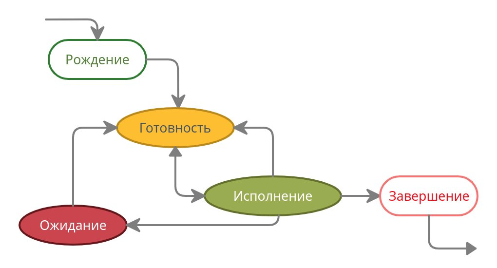
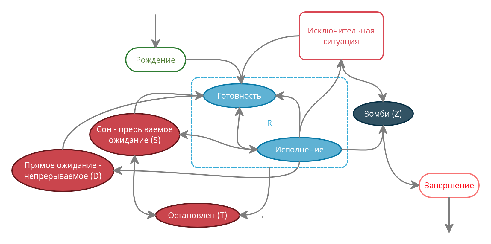

# Операционные системы (3 семестр, Маятин)

## Лекция 1

**Операционная система** - базовое системное программное обеспечение, управляюще работой вычислительного узла и реализующее универсальный интерфейс между аппаратным обеспечением, программным обеспечением и пользователем.

### Первый этап эволюции ОС: программы-диспетчеры

**Принципы архитектуры Фон Неймана**
1. Однородность памяти (код и данные в единой памяти)
2. Принцип адресности (оперативная память представляет собой линейно адресуемое пространство и процессор может обратиться к произвольной ячейке памяти в любой момент)
3. Программное управление
4. Всё кодируется с помощью двоичного кода

*Архитектуру Фон Неймана реализуют начиная с 40-х годов XX в.*

Процессор выполнял программы последовательно, инкрементируя адрес инструкции. Некоторые функции было необходимо использовать многократно. Чтобы не повторять один и тот же участок кода появилась идея использовать часть памяти для хранения часто повторяющихся инструкций (подпрограмм). Чтобы знать куда вернуться после выполнения подпрограммы создали **программы-диспетчеры**.

Процессор выполнял и работу с памятью, и вычисления. Очевидно, что для работы с памятью не требуется вся мощность процессора, поэтому создали **контроллеры**, которые умели только вычислять адреса и подгружать/выгружать данные.

**Прерывание** - сигнал, поступающий от внешнего устройства к ЦП, приостанавливающий выполнение текущего набора команд и передающий управление подпрограмме - обработчику прерываний. Работа с помощью контроллера - SPOOLing.

**Пакет** - совокупность программных модулей и данных (например, констант).

**Пакетная обработка (batch processing)** - выполнение "заданий, которые могут выполняться без взаимодействия с конечным пользователем или могут быть запланированы для выполнения, если позволяют ресурсы" (определение из интернета).

*Реализация пакетной обработки требует создания алгоритмов планирования, о которых будет вестись речь в дальнейшем.*

### Второй этап эволюции ОС: мультипрограммные ОС

*Идея*: несколько программ можно параллельно (фактически стали выполнять *псевдопараллельно*, так как количество потоков существенно превышало количество ядер, каждому процессу выделяется некоторое время для работы - кванты непрерывного выполнения, их длительность не превышает 1 мс).

**Варианты реализации псевдопараллельного выполнения:**
1. Использовать в коде специальные метки для переключения между потоками (раньше отказались, сейчас реализовано, например, в коорутинах Kotlin).
2. Таймер генерирует прерывания (уже были кварцевые часы), а обработчик прерываний решает, какой процесс дальше должен выполняться. Данный метод требует решения следующих задач:
   1. *Работа с регистрами*. Если программа загрузила данные в регистры, было сгенерированно прерывание, другой процесс испортил данные в регистрах, то после этого программа не сможет работать корректно. Решение - сохранение регистровых контекстов.
   2. *Работа с памятью*. Код нового процесса может быть где угодно, поэтому непонятно, как выполнять адресацию. Решение - концепция виртуальной памяти, использовать виртуальные адреса и подменять их физическими (*когда пересчитывать адреса?*).
   3. *Обеспечение защиты программных данных от других программ*. Программа может ошибиться с адрессаций и испортить данные "коллеги". Введена концепция защиты памяти, реализованная аппаратно, а также привелегированный режим - режим процессора, при котором отключается защита памяти.
        * **System call** - абстракция аналогичная механизму прерываний между ОС и ПО, обращение пользовательской программы к ядру ОС с требованием предоставить ресурсы и выполнить привелегированную операцию.
   4. *Планирование выполнения программы и использования ресурсов*. Теперь очередей много и они могут быть связаны между собой, а алгоритмы планирования должны быть высокопроизводительными. Представим, что есть два неразделяемых ресурса (r<sub>1</sub> и r<sub>2</sub>) и две программы (p<sub>1</sub> и p<sub>2</sub>). p<sub>1</sub> захватилa ресурс r<sub>1</sub>, p<sub>2</sub> захватила ресурс r<sub>2</sub>, в процессе выполнения программе p<sub>1</sub> потребовался ресурс r<sub>2</sub>, p<sub>2</sub> - r<sub>1</sub>. Такая ситуацию назвали **тупиком**. Данную проблему решал Дейкстра на протяжении 15-ти лет и в дальнейшем ей занимались его ученики. 
   5. *Универсальный доступ к информации на внешних устройствах*. Раннее внешнаяя память была устроена линейно, как RAM. Однако такой подход неэффективен, так как не понятно, какие разделы (конечного размера) выделять программам, что делать, если несколько программ хотят работать с одной областью памяти. Введено понятие *файла*.
        * **Файл** - именованная совокупность данных. Для удобства введена **файлово-каталожная модель доступа к файлам**, которая сейчас реализована разными способами (например, Windows использует древовидную модель, в Linux реализуют виртуальную структуру).
   6. *Обеспечение комуникации между программами*. Механизмы:
        * **Буфер** - область памяти, в которую можно класть информацию, которую необходимо передать в другой процесс.
        * **Конвееры** (1 лабораторная) - перенаправление потоков ввода и выводы в другие процессы.
        * **Именованные каналы** (3 лабораторная) - обмен сигналов между программами.
        * **Виртуальная машина** - механизм, который реализует изоляцию процессов и завершает концепцию операционной системы (50 - 60-е годы).

**Первая операционная система** (*1963 г, суперкомпьютер B5000 компании burroughs*) - MCP (main control program).

*На данном этапе развития были специальные заведения, в которых можно было ареновать машинное время, передать оператору перфокарту и выполнить программу (узнать, что ошибся в одном байте -_-).*


### Третий этап эволюции ОС: сетевые операционные системы.
*Теперь компьютеры стали более популярны, поэтому затраты на гостиницы и доставку перфокарт до ближайшего города с компьютером стали слишком не выгодны. Хочется многотерминальности. Идея - передавать сигнал удаленно (если что, по телефону диктовать код программы неудобно).*

**Модем** - модулятор/демодулятор. Передаёт аналоговый сигнал (например синусоиду), по которому можно определить 0 и 1.

**AT&T** - одна из первых компаний, которая стала заниматься реализацией многотерминальности, выкупала компьютеры и предоставляла вычислительные мощности ползователям.

**Проблемы**:
1. Поскольку теперь много терминалов, необходимо решать вопросы безопасности в условиях многопользовательского режима, пользователи могут иметь разные намерения. Появляются понятия *учетной записи*, *авторизации*, *аутентификации* и т. д.
2. Чем дальше компьютер - тем хуже сигнал, поэтому пользователи выбирают ближайшие компьютеры, однако нагрузка может разделяться неравномерно. Решение: некоторые компании выкупали замкнутые связи и перенаправляли пакеты на свободные вычислительные мощности - реализовывали **механизм сетевого обмена заданиями**, то, что мы сейчас воспринимаем как облака.

*- Кстати, очень советую, у нас есть музей связи. Может быть, кто-то был, он недалеко от Исакиевского Собора. Всем, кто занимается IT, я вообще просто советую туда сходить.*

## Лекция 2

**Четвертый уровень эволюции ОС**: у людей появилось желание сделать универсальную ОС, которая способна работать с на разных компьютерах и быть переносимой и содерждать в себе компилятор для высокоуровнего языка программирования. Проблема в том, что тогда её надо писать на высокоуровневом языке программирования. Парадокс. На решение проблемы ушло ~ 5 лет.

**Развитие происходило следующим образом:**

```
AT&T Bell Labs - язык C (Страуструп был с ними).
 |
MULTICS
 |
UNICS (ed.1 01.01.1970, ed.4 1975, ed.7 1978)
 |
UNIX
 |
BSD  ---  SUNOS
 |          |
 |          |   1983 - 1984 гг. - GNU/Linux
 |          |   1989 г. - NeXTSTEP
 |          |   1997 г. - NeXTSTEP выкуплен компанией Apple,
 |          |             на его основе с добавлением FreeBSD
 |          |             создан Darwin (в будущем - MacOS). 
 |          |   
 |          |
 |       SOLARIS
FreeBSD
OpenBSD
```

Свободы ПО:

0. Использовать
1. Изучать и адаптировать
2. Распространять
3. Улучшать и публиковать (лицензия Столлмана - copyleft - если я взял что-то под такой лицензией, то я обязываюсь выпускать его под той же лецензией)

GNU - (Gnu is Not Unix) - проект, который собирались распространять под лицензией copyleft. Требовалось переписать всю ОС. Главное достижение - GCC, в это время Линус Торвальдс разрабатывал свою операционную систему (на основе других существующих) - Linux, а в проекте GNU никто не решался писать ядро ОС. Впоследствии два этих проекта объединились в GNU/Linux.

Цель операционной системы обсеспечить производительность, надежность и безопасность *(чего?)* исполнения ПО, эксплуатации Hardware, хранения и передачи данных, диалога с пользователем.

**Функции:**

1. Управление разработкой и испольнения ПО
    * API
    * Управление исполнением
    * Обработка и обнаружение ошибок
    * Доступ у устройствам ввода/вывода
    * Доступ к хранилищу
    * Мониторинг ресурсов
2. Оптимизация использования ресурсов
    * Решение многокритериальной задачи по критериям (K<sub>1</sub>, K<sub>2</sub>, K<sub>3</sub>, ...), которые могут противоречить друг другу. Применяются следующие методики:
        * Метод свертки: оптимизация параметра R =  a<sub>1</sub>K<sub>1</sub> + ... + a<sub>n</sub>K<sub>n</sub>.
        * Real Time OS: оптимизация **условного критерия** K = a<sub>1</sub>K<sub>1</sub> + ... + a<sub>n - 1</sub>K<sub>n - 1</sub> при условии, что K<sub>n</sub> > z.
3. Поддерждка эксплуатации:
    * Диагностика
    * Восстановление
4. Поддержка развития самой ОС

**Функциональная архитектура современной ОС**

1. Подсистема управления процессами
    * Дескрипторы процессов (PCB - Process Control Block)
    * Планировщики
2. Подсистема управления памятью
    * Виртуальная память
    * Защита памяти
3. Подсистема управления файлами
    * Преобразование символьных имён в физические адреса
    * Управление каталогами (проблем много, например, в Windows файл может принадлежать только одному каталогу, а в Linux нескольким)
4. Подсистема управления внешними устройствами
    * Механизм драйверов 
    * Plug & Play
5. Подсистема защиты данных
    * Аутентификация и авторизация
    * Механизм аудита
6. API
    * Механизмы разработки ПО
    * Механизмы исполнения ПО
7. Пользовательский интерфейс
    * CLI (Command Line Interface) - нативно для Linux
    * GUI (Graphical User Interface) - нативно для Windows

## Лекция 3

### Архитектура ОС

*На сегодняшний день внутренняя организация ОС очень сильно отличается, есть как очень старые, так и молодые архитектуры. Универсального способа построения архитектуры нет - приходится искать компромисс (не можем найти экстремум целевой функции, не зная самой функции).*

**Привелегированный режим** - возможность обратиться в память по любому адресу и делать любые запросы к процессору.

**Резидентность** - свойство кода ОС - он находится в целиком в памяти и не меняет свои адреса.

**Код ядра** - та часть ОС, которая работает в привилегированном режиме и обладает резидентностью.

**Принципы построения современных ОС**:
1. Принцип модульной организации
2. Принцип функциональной избыточности - функционал ОС существенно больше любого частного сценария его использования
3. Принцип функциональной избирательности - должна быть возможность использовать только те функции, которые требуются
4. Принцип параметрической универсальности - */история про захардкоженные константы/*
5. Поддержка концепций многоуровневой иерархической системы 
6. Разделение модулей ОС на модули ядра и пользовательские модули

*Первой архитектурой стала **монолитной*** - "все видят всё" - никакой инкапсуляции, но получаем производительность.

Выделяли три слоя монолитной архитектуры (поддержка пятого принципа):
1. Main program - обеспечивает взаимодействие с ПО
2. Services
3. Utilites - работа с Hardware

Многослойная архитектура (скорее концепция, чем конкретная архитектура).

Удобно представлять в виде кругов (слоёв):
1. Hardware
2. Средства аппаратной поддержки ядра
3. Машинно-зависимые модули (HAL) - позволяют работать с микрокодом чипсета
4. Базовые механизмы ядра
5. Менеджеры ресурсов
6. Системные вызовы и API (наследник main program) *больше не надо в справочнике искать и составлять битсеты для системных вызовов, меньше рутины больше творчества.*

Проблемы монолитной архитектуры:
1. Неэффективное использование памяти (все надо держать в ОЗУ)
2. Нестабильность - небольшая ошибка где-то может привести к проблеме уровня сиситемы, неизвестно, где потом ошибка вылезет.
3. Сложность построения распределенных систем

*Сегодня компьютер - это энергонагревательный прибор (90% энергии тратится на обогрев окружающей среды). Саудовская Аравия не имеет дата-центров, а то на улице +40.*

**Концепция микроядерной архитектуры** - часть слоёв оставляем в ядре, а остальные вынесем в пользовательское пространство:
1. Hardware
2. Аппаратная поддержка ядра
3. Kernel:
   1. Системные вызовы
   2. Базовые механизмы
   3. HAL
4. User:
   1. CPU server
   2. Print server
   3. Mem server
   4. HDD server
   5. Applications

Вроде бы теряем производительность, так как теперь больше времени тратиться на переход из пользовательского режима и обратно, но зато память можем использовать эффективно, за счет чего приложения работают быстрее, так как не уходят в swap. Надежность вроде бы возрасла, но могут возникать тупики из-за того, что сложнее теперь всё синхронизировать. Всё неоднозначно, поэтому ОС по-разному её реализуют архитектуры в зависимости от архитектуры железа.

**Наноядерная архитектуры** - в ядре оставляем только HAL и упрощенный менеджер ресурсов. Используется в гипервизорах.

**Экзоядерная архитектура** - микроядерная, только наоборот, компоненты из Kernel и User поменялись местами. Экзотика, которая может использоваться например для ферм для майнинга, когда железо постоянно меняется (то, что взаимодействует с железом удобно выносить из ядра).

**Гибридные ядра** - идея в том, чтобы можно было пересобирать ядра и переносить компоненты из Kernel в User и наоборот - теоритическая архитектура, на практике не применяется.

## Лекция 4. Управление процессами

**Процесс** (*process*) - совокупность набора исполняющихся команд, ассоциированных с ним ресурсов и контекста исполнения, находящаяся под управлением ОС.

**Process Control Block (PCD)** - дескриптор процесса - процесс для ОС. Создание процесса равносильно созданию этой структуры данных.

Составляющие дескриптора процесса:
1. Идентификаторы:
   * PID (Process Identifier)
   * PPID (Parent PID)
   * UID (User Identifier)
2. Ресурсы
3. История использования ресурсов 

В Linux существует псевдо- файловая система - универсальный интерфейс с помощью которого можно работать с дескрипторами процессов. Примеры:
```
cat /proc/$PID/status
cat /proc/$PID/sched
```

*Со временем абстракции процессов не хватало. Идея: хорошо бы разрешить разным процессам использовать одни и те же ресурсы (мотивация - увеличение производительности засчет использование многоядерности; каждый процесс изолирован). Появляется понятие потоков.*

**Процесс** (*thread*) - совокупность набора исполняющихся команд и контекста исполнения, находящаяся под управлением ОС, и разделяющая ресурсы некоторого процесса. 

*Заметим, что каждый поток требует накладных ресурсов, поэтому если надо выбирать оптимальное количество потоков. Его найти не так просто, так как код может исполняться на разных ПК с разными процессорами, размером ОЗУ, количеством ядер. Помимо этого возникает естественное желание сделать так, чтобы потоки исполнялись более-менее равномерно, но может случится так, что у ОС появится "любимчик", который будет работать больше остальных. Это приведет к тому, что не будет достигнута желаемая производительность программы. Всё это привело людей к мысли о том, что абстракции потоков тоже мало.*

**fiber** - облегченные потоки - набор команд, разделяющий ресурсы и контекст исполнения одного потока, находящийся под управлением пользовательского приложения.

*thread - нить, fiber - волокно)*

**Плюсы fiber**:
1. Сами управляем облегченными потоками, поэтому можем решать, кто и когда будет работать.
2. Экономим ресурсы - меньше обращений к ядру.
3. Не создаем лишних структур для контекста.

**Минус**: теперь придется самими всем этим управлять, ОС имеет много механизмов для управления потоками, а у нас нет. ОС реализует вытеснительную многозадачность. Для реализации многопоточности на уровне облегченных потоков используется кооперативная многозадачность.

*Примеры реализаций: на уровне ОС, Kotlin coorutins и другие.*

*/\* история про браузеры \*/. Каждая вкладка - отдельный процесс. В одном нельзя сделать в одном потоке, это нарушает безопасность. Почему же тогда у нас всё не работает очень медленно, если мы на протяжении многих лет копим двести вкладок? В реальности есть еще один уровень абстракции - механизм квотирования ресурсов - job в Windows и CGroup (control group) в Linux.*

Процессы порожденные одним приложением получаю квоту на использование ресурсов (например, треть ОЗУ).

*/\* итория про торренты \*/ юный подаван, который пока еще не знает как работают торренты, но умеет открывать нажимать кнопочки и изменять настройки решил увеличить число потоков. Поставил максимально возможное количество. При этом, как добропорядочный пират он еще и раздает после скачивания свои 100500 торрентов. А потом преподаватель попросил его включить камеру в Zoom, да еще и расшарить экран. При его 100 Мб/с всё жутко лагает. Почему же так происходит? Zoom борется за ресурсы с двумястами другими потоками)*

```
job/CGroup
    |
process[1] ... process[N]
    |
(thread[1] ... thread[M])
    |
(fiber[1] ... fiber[K]) 
```

*Далее мы будем рассматривать только процессы, а все остальное уже в других курсах.*

**Функции ОС по управлению процессами**:
1. Создание (рождение)
2. Обеспечение ресурсами
3. Изоляция
4. Планирование
5. Диспетчеризация
6. Межпроцессное взаимодействие
7. Синхронизация
8. Завершение

### Создание (рождение) процессов

В Linux процессы образуют дерево и порождаются клонированием. Есть какой-то начальный процесс, который имеет PID = 1, и называется init или systemd (зависит от дистрибутивов). Далее процессы порождают друг друга. Есть вопрос, если каждый процесс порождается другим, то как породить самый первый? Обычно это реализовано с помощью костылей. У процесса с PID = 1 есть PPID = 0, но процесса с PID = 0 не существует (на самом деле на одной из лабораторных мы выяесним, что существует два процесса с PPID = 0, так как есть два дерева - дерево пользовательских процессов и дерево процессов ядра).

Зачем нам нужно дерево? В Linux родитель отвечает за порожденные процессы. Например, если процесс завершается, то он посылает родителю код SIGCHILD, который родитель должен обработать. Как только SIGCHILD будет прочитан, ОС удаляет PID завершенного процесса.

Чтобы при завершении родительского процесса не завершались дочерние (если это, конечно, требуется), реализована возможность перевязывания процесса в дереве. Перевязанный процесс называется демоном. Притом процесс можно с самого начала запустить как демона.

Если процесс завершается аварийно (например, встретился с делением на ноль), его дочерние процессы также становятся демонами.

Процесс может, например, зациклится, но существует комбинация клавиш `Ctrl + C`, которая завершает процесс, но это работает не всегда. На форумах можно почитать про то, что есть еще `Ctrl + Z`. Когда мы её применяем, происходит довольно сложная процедура. Посылается сигнал SIGSTOP. ОС затормаживает, а не убиват процесс. Дальше мы можем разбираться с тем, что случилось.

*Представим, что у нас есть СУБД на сервере, которая потребляет очень много ОЗУ, ведет себя неприлично. Притом видно, что есть несколько больших незавершенных транзакций и убивать процесс опасно, так как можно испортить какие-нибудь данные. Тогда посылаем сигнал SIGSTOP. Процесс больше не реагирует ни на что и просто ждет, когда его "разморозят".*

Если у замороженного процесса были дочерние процессы и кто-то из детей прислал SIGCHILD и завершился, возникает проблема. Он не может прочитать SIGCHILD, поэтому PID дочернего процесса не удаляется. Тогда дочерний процесс называют зомби - неупокоенный. Похожая ситуация возникает, если у такого процесса возникает тупик с кем-то из ресурсов.

Зомби-процессы опасны тем, что количество возможных значений PID конечно. Может случиться зомби-апокалипсис, если процесс порождает зомби, которые тратят PID'ы. Единственный способ избавиться от зомби - завершить родителя. На такой случай в Linux есть сигнал SIGKILL. Его может отправить только пользователь.

Дочерний процесс создаётся с помощью одного или двух системных вызовов: FORK - копируется адресное пространство родителя, EXAC - подменяет сегмент кода на код нужного процесса. Следовательно, никакой процесс не может получить больше прав, чем его родитель. Это позволяет достичь высокого уровня безопасности.

В Windows есть диспетчер (менеджер) процессов. Когда мы хотим породить новый процесс, надо обратиться к диспетчеру и он породит новый чистый процесс. Никаких зомби и усыновлений, вроде бы хорошо, но безопасность ниже, так как новый процесс может иметь большие права.

## Лекция 6. 

**Диспетчеризация процессов** - управление изменением состояния процессов.

**Модель переходов:**


В Linux "Готовность" и "Исполнение" объеденены в `R` для пользователя (разделять смысла нет), ожидание разделяется на прерываемое (сон) - `S`, и непрерываемое (прямое) - `D`, есть дополнительное состояние "остановлен", в которое можно попасть из `S` или `R`, и из которого можно вернуться в `S` или "готовность". Также присутствуют состояния "зомби" и "исключительная ситуация":


### Алгоритмы планирования

Для переходов между рождением и готовностью применяется долгосрочное планирование, а между готовностью и исполнением краткосрочное.

**Критерии оценки алгоритмов планирования**:
1. Критерий справедливости
2. Критерий эффективности
3. Полное время исполнения
4. Время ожидания
5. Сокращение времени отклика

**Свойства алгоритмов планирования**:
1. Предсказуемость
2. Минимальные накладные расходы
3. Масштабируемость

*Замечание: конкретная реализация алгоритмов часто очень сильно отличается от математической модели, например, алгоритм с громким названием O(1) работал с константой 140, поэтому от него отказались.*

**Параметры планирования**
1. Статические параметры
    1. Системы - ограничения, например, тактовая частота процессора.
    2. Процесса - не меняются во времени: права доступа, приоритет процесса.
2. Динамические параметры
    1. Системы - изменяющиеся параметры, например, количество свободной ОЗУ.
    2. Процесса - наиболее актуальны:
        * CPU-burst - время, которое процесс будет работать, если не будет конкурировать за процессор,
        * I/O-burst - аналогичный параметр для ввода и вывода.
